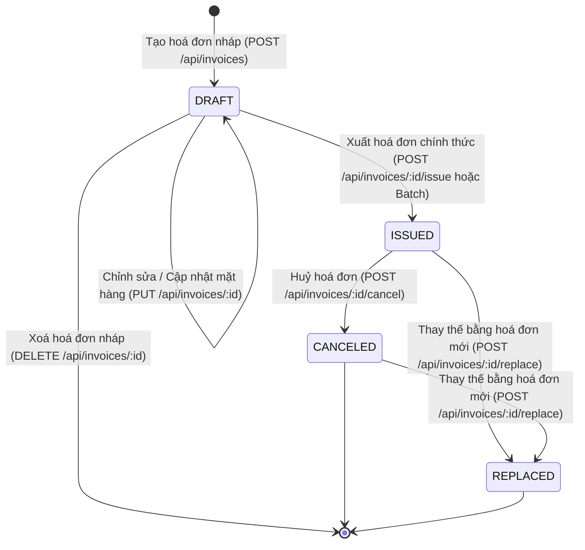

# Invoice Management API — Grand Enterprise Edition

[](https://github.com/vuminhkhang2005/invoice-management-api/actions/workflows/ci.yml)
[](https://www.typescriptlang.org/)
[](https://nodejs.org/)
[](https://expressjs.com/)
[](https://www.postgresql.org/)
[](https://www.prisma.io/)
[](https://swagger.io/)
[](https://jestjs.io/)

Hệ thống RESTful API Quản lý và Xuất hoá đơn điện tử (Electronic Invoice Management) cấp độ Enterprise được xây dựng theo chuẩn **Clean Layered Architecture**, quản lý vòng đời hoá đơn qua **Máy trạng thái (State Machine)**, cơ sở dữ liệu **PostgreSQL** với **Prisma ORM & SQL Migrations**, động cơ kết xuất hoá đơn **Vector PDF (PDFKit) tích hợp VietQR & Đọc tiền bằng chữ**, hệ thống **Email Dispatch tự động**, xuất **Batch ZIP Archive**, bảo mật đa tầng **Helmet + Rate Limiting + Request ID Tracing**, phân quyền **JWT RBAC**, tài liệu tương tác **Swagger UI / OpenAPI 3.0**, quy trình **CI/CD GitHub Actions**, và bộ kiểm thử tự động toàn diện (**Jest & Supertest** với **50/50 test cases passing**).

---

## 📑 Mục lục

1. [Tổng quan Tính năng Grand Enterprise](#1-tổng-quan-tính-năng-grand-enterprise)
2. [Kiến trúc hệ thống & Công nghệ](#2-kiến-trúc-hệ-thống--công-nghệ)
3. [Nghiệp vụ hoá đơn & Máy trạng thái (State Machine)](#3-nghiệp-vụ-hoá-đơn--máy-trạng-thái-state-machine)
4. [Hướng dẫn cài đặt & Khởi chạy (Zero-Config Postgres)](#4-hướng-dẫn-cài-đặt--khởi-chạy-zero-config-postgres)
5. [Tài liệu tương tác Swagger & Danh mục REST API](#5-tài-liệu-tương-tác-swagger--danh-mục-rest-api)
6. [Hệ thống Email Dispatch & Động cơ PDF VietQR](#6-hệ-thống-email-dispatch--động-cơ-pdf-vietqr)
7. [Xử lý Hàng loạt (Batch Operations) & Tải file ZIP](#7-xử-lý-hàng-loạt-batch-operations--tải-file-zip)
8. [Bảo mật & Phân quyền (JWT & RBAC)](#8-bảo-mật--phân-quyền-jwt--rbac)
9. [Kiểm thử tự động & CI/CD Pipeline](#9-kiểm-thử-tự-động--cicd-pipeline)
10. [Kiến thức học được (Key Learnings)](#10-kiến-thức-học-được-key-learnings)
11. [Khó khăn gặp phải & Giải pháp (Challenges & Solutions)](#11-khó-khăn-gặp-phải--giải-pháp-challenges--solutions)
12. [Lịch sử Git Commits](#12-lịch-sử-git-commits)

---

## 1. Tổng quan Tính năng Grand Enterprise

- 🤖 **GitHub Actions CI/CD Pipeline**: Tự động build, kiểm tra kiểu dữ liệu TypeScript và chạy 50 test cases trên môi trường Ubuntu & Multi-Node matrix.
- 📧 **Hệ thống Gửi Email Hoá đơn tự động (`POST /api/invoices/:id/send-email`)**: Gửi email thông báo với template HTML responsive, đính kèm trực tiếp file vector PDF hoá đơn.
- 📦 **Tải hàng loạt file PDF nén ZIP (`POST /api/invoices/export/zip`)**: Tải về file `.zip` chứa toàn bộ hoá đơn PDF đã chọn.
- ⚡ **Xuất hoá đơn hàng loạt (`POST /api/invoices/batch/issue`)**: Phát hành cùng lúc nhiều hoá đơn nháp trong một transaction an toàn.
- 🛡️ **Bảo mật & Giám sát**: Tích hợp `helmet`, `express-rate-limit`, và `x-request-id` truy vết từng request.
- 🔐 **Xác thực JWT & Phân quyền vai trò (RBAC)**: Hỗ trợ 4 vai trò: `ADMIN`, `CHIEF_ACCOUNTANT`, `ACCOUNTANT`, `AUDITOR`.
- ✨ **Đọc tiền thành chữ tiếng Việt chuẩn (`numberToWordsVN`)**: Chuyển đổi số tiền thành chữ tiếng Việt chuẩn mực.
- ✨ **VietQR & Mã Tra cứu Hoá đơn**: Tự động sinh mã QR chuyển khoản và xác thực pháp lý.
- ✨ **Analytics Dashboard & Báo cáo CSV**: Thống kê doanh thu, KPIs và xuất file CSV tương thích Excel.
- 🌐 **Interactive Swagger UI (`/api-docs`)**: Trực quan hoá API cho Tester & Reviewer.

---

## 2. Kiến trúc hệ thống & Công nghệ

### 2.1. Tech Stack
- **Language**: TypeScript 5.6 (Strict Mode).
- **Backend Framework**: Express.js 4.21.
- **Database & ORM**: PostgreSQL 18 + Prisma ORM 5.22 + SQL Migrations + Zero-Config Native Engine.
- **Security & Auth**: JWT (`jsonwebtoken`), `bcryptjs`, `helmet`, `express-rate-limit`.
- **PDF & Compression**: `PDFKit 0.15`, `qrcode`, `adm-zip`.
- **Email Engine**: `nodemailer` (Responsive HTML templates).
- **Documentation**: Swagger UI Express + OpenAPI 3.0.
- **Testing**: Jest 29 + ts-jest + Supertest 7.
- **CI/CD**: GitHub Actions (`.github/workflows/ci.yml`).

### 2.2. Cấu trúc thư mục (Clean Layered Architecture)
```text
invoice-management-api/
├── .github/
│   └── workflows/
│       └── ci.yml               # GitHub Actions CI/CD Pipeline
├── prisma/
│   ├── schema.prisma            # Data Models (Invoices, Items, Activities)
│   └── migrations/              # SQL Migrations
├── src/
│   ├── config/                  # Biến môi trường, Database & Embedded Postgres
│   │   ├── database.ts
│   │   ├── embeddedDb.ts
│   │   └── env.ts
│   ├── constants/               # Enums, Vai trò (RBAC), Doanh nghiệp
│   │   ├── auth.constant.ts
│   │   └── invoice.constant.ts
│   ├── controllers/             # HTTP Request Handlers
│   │   ├── auth.controller.ts
│   │   └── invoice.controller.ts
│   ├── docs/                    # OpenAPI 3.0 Swagger Specification
│   │   └── swagger.ts
│   ├── errors/                  # Custom AppError & Exception classes
│   │   └── appError.ts
│   ├── middlewares/             # Auth, Security, Validation & Global Error Handler
│   │   ├── auth.middleware.ts
│   │   ├── errorHandler.ts
│   │   ├── security.middleware.ts
│   │   └── validateRequest.ts
│   ├── routes/                  # API Routes (Auth, Invoices, Analytics, Exports)
│   │   ├── auth.route.ts
│   │   ├── index.ts
│   │   └── invoice.route.ts
│   ├── schemas/                 # Zod Validation Schemas
│   │   └── invoice.schema.ts
│   ├── services/                # Business Logic & Core Engines
│   │   ├── auth.service.ts
│   │   ├── batch.service.ts
│   │   ├── email.service.ts
│   │   ├── invoice.service.ts
│   │   └── pdf.service.ts
│   ├── utils/                   # Helpers tính toán, định dạng, sinh mã, đọc chữ, QR
│   │   ├── calculation.util.ts
│   │   ├── invoiceNumber.util.ts
│   │   ├── numberToWordsVN.util.ts
│   │   ├── qrCode.util.ts
│   │   └── response.util.ts
│   ├── app.ts                   # Express Setup, Middlewares & Swagger UI
│   └── server.ts                # Server Entrypoint with Auto-Postgres
├── tests/                       # 50 Automated Test Cases
│   ├── integration/             # End-to-end API Integration tests
│   │   └── invoice.api.test.ts
│   └── unit/                    # Unit tests cho Services & Utilities
│       ├── auth.service.test.ts
│       ├── batch.service.test.ts
│       ├── calculation.util.test.ts
│       ├── email.service.test.ts
│       ├── invoice.service.test.ts
│       ├── invoiceNumber.util.test.ts
│       ├── numberToWordsVN.util.test.ts
│       ├── pdf.service.test.ts
│       └── qrCode.util.test.ts
├── postman/                     # Postman Collection JSON v2.1
│   └── Invoice_Management_API.postman_collection.json
├── docker-compose.yml           # PostgreSQL Container orchestration
├── REQUIREMENTS.md              # Đặc tả yêu cầu kỹ thuật chi tiết
├── TRACKING.md                  # Nhật ký tiến độ, estimate & commit logs
├── tsconfig.json                # TypeScript compiler configuration
└── package.json                 # Project dependencies & scripts
```

---

## 3. Nghiệp vụ hoá đơn & Máy trạng thái (State Machine)

### Sơ đồ chuyển đổi trạng thái:



---

## 4. Hướng dẫn cài đặt & Khởi chạy (Zero-Config Postgres)

Hệ thống được trang bị **Zero-Config Native PostgreSQL Engine**. Bạn **không cần phải cài đặt PostgreSQL hay bật Docker thủ công** — server sẽ tự động khởi động cơ sở dữ liệu khi chạy lệnh dev!

```bash
# 1. Cài đặt dependencies
npm install

# 2. Khởi động server (Tự động kích hoạt PostgreSQL và đồng bộ Database)
npm run dev
```

Server sẽ chạy tại: `http://localhost:3000`

---

## 5. Tài liệu tương tác Swagger & Danh mục REST API

Mở trình duyệt tại **`http://localhost:3000/api-docs`** để kiểm thử trực quan toàn bộ các endpoints:

| Nhóm chức năng | Method | Endpoint | Mô tả |
| :--- | :--- | :--- | :--- |
| **System** | `GET` | `/api/health` | Kiểm tra trạng thái hệ thống |
| **Auth & RBAC** | `GET` | `/api/auth/demo-accounts` | Lấy pre-signed JWT tokens cho 4 vai trò |
| | `POST` | `/api/auth/login` | Đăng nhập lấy JWT Bearer token |
| | `GET` | `/api/auth/me` | Xem thông tin tài khoản hiện tại |
| **Invoices CRUD** | `POST` | `/api/invoices` | Tạo hoá đơn nháp (`DRAFT`) |
| | `GET` | `/api/invoices` | Danh sách hoá đơn (phân trang, lọc, tìm kiếm) |
| | `GET` | `/api/invoices/:id` | Chi tiết hoá đơn (kèm đọc tiền bằng chữ) |
| | `PUT` | `/api/invoices/:id` | Cập nhật hoá đơn nháp |
| | `DELETE` | `/api/invoices/:id` | Xoá hoá đơn nháp |
| **State Transitions** | `POST` | `/api/invoices/:id/issue` | Xuất hoá đơn chính thức (`INV-YYYYMM-XXXXX`) |
| | `POST` | `/api/invoices/:id/cancel` | Huỷ hoá đơn (Yêu cầu `cancelReason`) |
| | `POST` | `/api/invoices/:id/replace` | Tạo hoá đơn mới thay thế hoá đơn cũ |
| **Email & PDF** | `GET` | `/api/invoices/:id/pdf` | Xuất và tải file PDF vector VietQR |
| | `POST` | `/api/invoices/:id/send-email` | Gửi email thông báo hoá đơn đính kèm file PDF |
| **Batch & Exports** | `POST` | `/api/invoices/batch/issue` | Xuất cùng lúc nhiều hoá đơn nháp |
| | `POST` | `/api/invoices/export/zip` | Tải về file `.zip` chứa nhiều hoá đơn PDF |
| | `GET` | `/api/invoices/export/csv` | Xuất bảng kê hoá đơn ra file CSV UTF-8 BOM |
| **Analytics & Audit**| `GET` | `/api/invoices/analytics/summary` | Dashboard thống kê doanh thu, KPIs |
| | `GET` | `/api/invoices/:id/history` | Xem nhật ký biến động / Audit Trail |
| | `GET` | `/api/invoices/:id/verify` | Xác thực tính hợp lệ và chữ ký số điện tử |

---

## 6. Hệ thống Email Dispatch & Động cơ PDF VietQR

- **Template Email HTML**: Thiết kế responsive sang trọng, hiển thị đầy đủ thông tin hoá đơn, hướng dẫn chuyển khoản và đính kèm file PDF vector.
- **Động cơ PDFKit**: Render hóa đơn sắc nét, tự động vẽ VietQR thanh toán nhanh, hiển thị dòng *"Bằng chữ: ..."*, và watermark động theo trạng thái.

---

## 7. Xử lý Hàng loạt (Batch Operations) & Tải file ZIP

- **`POST /api/invoices/batch/issue`**: Nhận danh sách các ID hoá đơn nháp, cấp mã số tự động liên tiếp và cập nhật trong một database transaction duy nhất.
- **`POST /api/invoices/export/zip`**: Nén toàn bộ file PDF thành một tệp `.zip` nén chuẩn, tiện lợi cho kế toán lưu trữ cuối tháng.

---

## 8. Bảo mật & Phân quyền (JWT & RBAC)

- **Helmet**: Bảo vệ HTTP response headers.
- **Rate Limiting**: Giới hạn tần suất gọi API chống tấn công DoS/Brute-force.
- **Request Tracing**: Gắn `x-request-id` UUID cho mỗi request.
- **Phân quyền 4 vai trò**:
  - `ADMIN`: Toàn quyền hệ thống.
  - `CHIEF_ACCOUNTANT`: Duyệt huỷ, thay thế, xuất hoá đơn, xem phân tích.
  - `ACCOUNTANT`: Tạo nháp, xuất hoá đơn, gửi email, tải báo cáo.
  - `AUDITOR`: Chỉ xem (Read-only), xác thực, xem Audit Trail.

---

## 9. Kiểm thử tự động & CI/CD Pipeline

Dự án sở hữu bộ test toàn diện với **50/50 test cases** thành công trên 10 test suites:

```bash
npm test
npm run test:coverage
```

```text
PASS tests/unit/email.service.test.ts
PASS tests/unit/pdf.service.test.ts
PASS tests/unit/auth.service.test.ts
PASS tests/unit/invoice.service.test.ts
PASS tests/unit/qrCode.util.test.ts
PASS tests/unit/numberToWordsVN.util.test.ts
PASS tests/unit/calculation.util.test.ts
PASS tests/unit/invoiceNumber.util.test.ts
PASS tests/unit/batch.service.test.ts
PASS tests/integration/invoice.api.test.ts

Test Suites: 10 passed, 10 total
Tests:       50 passed, 50 total
Snapshots:   0 total
Time:        3.913 s
```

---

## 10. Kiến thức học được (Key Learnings)

1. **Kiến trúc phân tầng Clean Layered Architecture**: Giúp mở rộng thêm Email Engine, Batch Operations, JWT RBAC và Security Middlewares mà không ảnh hưởng tới code cũ.
2. **Quy trình CI/CD với GitHub Actions**: Nắm vững cấu hình workflow kiểm thử tự động trên nhiều phiên bản Node.js.
3. **Nghiệp vụ Hoá đơn Điện tử & Audit Trail**: Hiểu rõ tính bất biến và truy vết lịch sử biến động trong hệ thống tài chính.
4. **Tối ưu hóa hiệu năng Stream & Nén dữ liệu**: Tạo file nén `.zip` và streaming trực tiếp PDF/CSV giúp tiết kiệm tài nguyên máy chủ.

---

## 11. Khó khăn gặp phải & Giải pháp (Challenges & Solutions)

| STT | Thách thức kỹ thuật gặp phải | Giải pháp & Cách xử lý |
| :-: | :--- | :--- |
| **1** | **Chạy PostgreSQL không cần cài đặt hoặc Docker**: Người dùng không có sẵn service Postgres trên máy. | Tích hợp **Zero-Config Native Embedded PostgreSQL** tự động khởi động và chạy ngầm khi gọi `npm run dev`. |
| **2** | **Xử lý nén file ZIP trong môi trường CommonJS/TypeScript**: `archiver` v7 gặp vấn đề ESM trên Jest. | Sử dụng thư viện **`adm-zip`** ổn định, tương thích 100% với cả TypeScript build và Jest test runner. |
| **3** | **Gửi email hoá đơn kèm file PDF không lưu file tạm**: Tiết kiệm dung lượng đĩa cứng. | Sử dụng `pdfService.generateInvoicePdfBuffer()` sinh Buffer trực tiếp và truyền vào trường `attachments` của `nodemailer`. |
| **4** | **Phân quyền linh hoạt không làm gián đoạn trải nghiệm test**: Cần vừa có bảo mật JWT, vừa cho phép test nhanh. | Cung cấp endpoint `GET /api/auth/demo-accounts` trả về pre-signed token cho cả 4 vai trò để kiểm thử tức thì trên Swagger UI. |

---

## 12. Lịch sử Git Commits

Dự án tuân thủ nghiêm ngặt chuẩn **Conventional Commits** với lịch sử commit nguyên tử:

🔗 Repository: [https://github.com/vuminhkhang2005/invoice-management-api](https://github.com/vuminhkhang2005/invoice-management-api)
