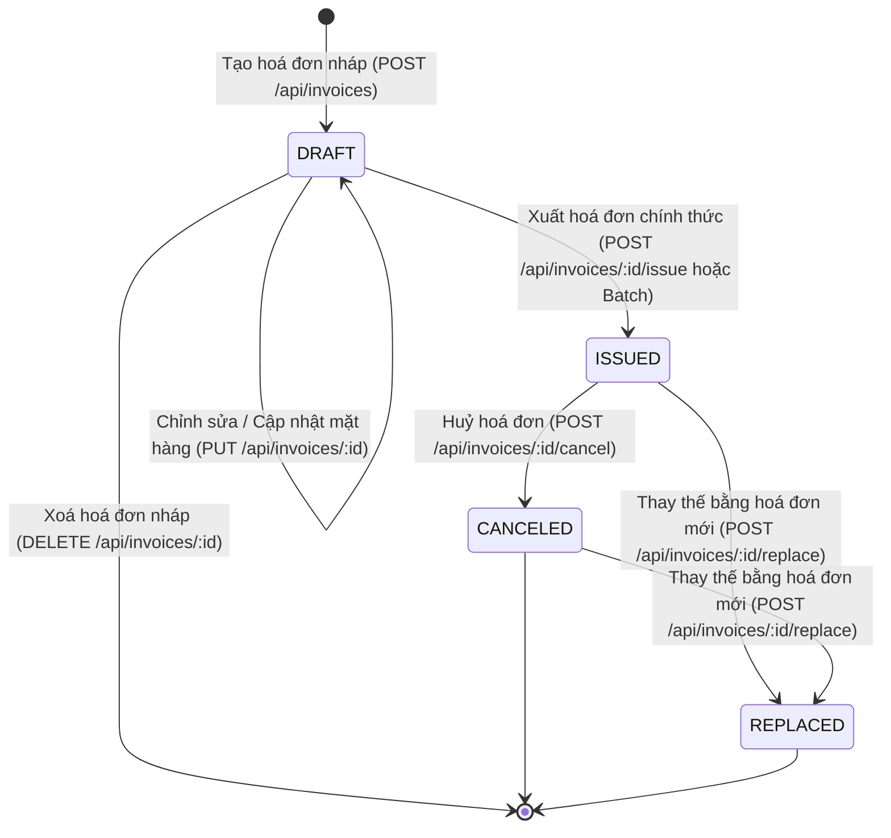

# Invoice Management API — Grand Enterprise Edition

[](https://github.com/vuminhkhang2005/invoice-management-api/actions/workflows/ci.yml)
[](https://www.typescriptlang.org/)
[](https://nodejs.org/)
[](https://expressjs.com/)
[](https://www.postgresql.org/)
[](https://www.prisma.io/)
[](https://swagger.io/)
[](https://jestjs.io/)

> **Intern Technical Assessment — Electronic Invoice Management API**  
> **Ứng viên**: Vũ Minh Khang  
> **Repository**: [https://github.com/vuminhkhang2005/invoice-management-api](https://github.com/vuminhkhang2005/invoice-management-api)  
> **Interactive Swagger UI**: [http://localhost:3000/api-docs](http://localhost:3000/api-docs)

---

## 📑 Mục lục

1. [Giới thiệu & Mục tiêu Dự án](#1-giới-thiệu--mục-tiêu-dự-án)
2. [Kiến trúc Hệ thống & Ngăn xếp Công nghệ](#2-kiến-trúc-hệ-thống--ngăn-xếp-công-nghệ)
3. [Nghiệp vụ Hoá đơn Điện tử & Máy Trạng thái (State Machine)](#3-nghiệp-vụ-hoá-đơn-điện-tử--máy-trạng-thái-state-machine)
4. [Hướng dẫn Cài đặt & Khởi chạy (Zero-Config Postgres)](#4-hướng-dẫn-cài-đặt--khởi-chạy-zero-config-postgres)
5. [Tài liệu Tương tác Swagger & Danh mục RESTful Endpoints](#5-tài-liệu-tương-tác-swagger--danh-mục-restful-endpoints)
6. [Hệ thống Email Dispatch & Động cơ PDF VietQR](#6-hệ-thống-email-dispatch--động-cơ-pdf-vietqr)
7. [Xử lý Hàng loạt (Batch Operations) & Tải file ZIP](#7-xử-lý-hàng-loạt-batch-operations--tải-file-zip)
8. [Bảo mật & Phân quyền Vai trò (JWT & RBAC)](#8-bảo-mật--phân-quyền-vai-trò-jwt--rbac)
9. [Kiểm thử Tự động & Quy trình CI/CD](#9-kiểm-thử-tự-động--quy-trình-cicd)
10. [🎓 Những kiến thức tôi đã học được (Key Learnings)](#10--những-kiến-thức-tôi-đã-học-được-key-learnings)
11. [⚡ Những khó khăn gặp phải & Giải pháp Kỹ thuật (Challenges & Solutions)](#11--những-khó-khăn-gặp-phải--giải-pháp-kỹ-thuật-challenges--solutions)
12. [⏱️ Tư duy Ước lượng Thời gian (Estimation Thinking) & Tiến độ](#12-️-tư-duy-ước-lượng-thời-gian-estimation-thinking--tiến-độ)
13. [🌳 Lịch sử Git Commits](#13-lịch-sử-git-commits)

---

## 1. Giới thiệu & Mục tiêu Dự án

Dự án **Invoice Management API — Grand Enterprise Edition** được xây dựng nhằm giải quyết bài toán cốt lõi của phần mềm Quản lý Hoá đơn Điện tử tại Việt Nam theo tinh thần **Nghị định 123/2020/NĐ-CP** và **Thông tư 78/2021/TT-BTC**.

### Các tính năng cốt lõi & mở rộng tiêu biểu:
- **Quản lý Vòng đời Hoá đơn**: Nghiêm ngặt chuyển đổi qua các trạng thái `DRAFT` ➔ `ISSUED` ➔ `CANCELED` / `REPLACED`.
- **Bảo toàn Tính Bất Biến (Immutability)**: Hoá đơn một khi đã phát hành (`ISSUED`) sẽ bị khoá hoàn toàn, không thể chỉnh sửa hoặc xoá.
- **Động cơ PDF Vector & VietQR**: Render hoá đơn vector sắc nét, tự động tính toán thuế VAT, đọc tiền thành chữ tiếng Việt chuẩn xác và nhúng mã QR thanh toán ngân hàng.
- **Hệ thống Email Tự động**: Gửi email thông báo hoá đơn kèm file PDF đính kèm qua HTML template responsive.
- **Batch Operations & ZIP Export**: Xuất hoá đơn hàng loạt và tải về file `.zip` nén danh sách PDF.
- **Bảo mật & Phân quyền Doanh nghiệp**: Tích hợp JWT, phân quyền 4 vai trò (Admin, Kế toán trưởng, Kế toán, Kiểm toán), Helmet, Rate Limiting và Request ID Tracing.
- **DevOps CI/CD**: Pipeline GitHub Actions tự động kiểm thử và build trên nhiều phiên bản Node.js.

---

## 2. Kiến trúc Hệ thống & Ngăn xếp Công nghệ

### 2.1. Tech Stack
- **Ngôn ngữ**: TypeScript 5.6 (Strict Mode, ES2022).
- **Web Framework**: Express.js 4.21 (Clean Layered Architecture: Routes ➔ Controllers ➔ Services ➔ Database/Utils).
- **Cơ sở dữ liệu**: PostgreSQL 18 + Prisma ORM 5.22 + SQL Migrations + Native Embedded Engine.
- **Validation**: Zod (Schema-based runtime request validation).
- **PDF Engine & Compression**: `pdfkit`, `qrcode`, `adm-zip`.
- **Email Service**: `nodemailer` (Responsive HTML templates).
- **Bảo mật**: `jsonwebtoken`, `bcryptjs`, `helmet`, `express-rate-limit`.
- **Tài liệu API**: OpenAPI 3.0 + Swagger UI Express.
- **Testing**: Jest 29 + ts-jest + Supertest 7 (55/55 Tests Passing).
- **CI/CD**: GitHub Actions (`.github/workflows/ci.yml`).

### 2.2. Cấu trúc thư mục (Clean Architecture)
```text
invoice-management-api/
├── .github/
│   └── workflows/
│       └── ci.yml               # GitHub Actions CI/CD Pipeline
├── prisma/
│   ├── schema.prisma            # Data Models (Invoices, Items, Activities)
│   └── migrations/              # SQL Migrations
├── src/
│   ├── config/                  # Database connection, embedded engine & env
│   │   ├── database.ts
│   │   ├── embeddedDb.ts
│   │   └── env.ts
│   ├── constants/               # Enums, Roles, Company info
│   │   ├── auth.constant.ts
│   │   └── invoice.constant.ts
│   ├── controllers/             # HTTP Request Handlers
│   │   ├── auth.controller.ts
│   │   └── invoice.controller.ts
│   ├── docs/                    # OpenAPI 3.0 Swagger Specification
│   │   └── swagger.ts
│   ├── errors/                  # Custom AppError & Exception classes
│   │   └── appError.ts
│   ├── middlewares/             # Auth, Security, Validation, Error Handlers
│   │   ├── auth.middleware.ts
│   │   ├── errorHandler.ts
│   │   ├── security.middleware.ts
│   │   └── validateRequest.ts
│   ├── routes/                  # API Routers
│   │   ├── auth.route.ts
│   │   ├── index.ts
│   │   └── invoice.route.ts
│   ├── schemas/                 # Zod Validation Schemas
│   │   └── invoice.schema.ts
│   ├── services/                # Core Business Services
│   │   ├── auth.service.ts
│   │   ├── batch.service.ts
│   │   ├── email.service.ts
│   │   ├── invoice.service.ts
│   │   └── pdf.service.ts
│   ├── utils/                   # Calculations, Number-to-Words, VietQR
│   │   ├── calculation.util.ts
│   │   ├── invoiceNumber.util.ts
│   │   ├── numberToWordsVN.util.ts
│   │   ├── qrCode.util.ts
│   │   └── response.util.ts
│   ├── app.ts                   # Express App & Global Middlewares
│   └── server.ts                # Server entrypoint with Auto-Postgres
├── tests/                       # 55 Automated Test Cases
│   ├── integration/             # End-to-end API Integration tests
│   │   └── invoice.api.test.ts
│   └── unit/                    # Unit tests cho Services & Utilities
│       ├── auth.service.test.ts
│       ├── batch.service.test.ts
│       ├── calculation.util.test.ts
│       ├── email.service.test.ts
│       ├── invoice.service.test.ts
│       ├── invoiceNumber.util.test.ts
│       ├── numberToWordsVN.util.test.ts
│       ├── pdf.service.test.ts
│       └── qrCode.util.test.ts
├── postman/                     # Postman Collection JSON v2.1 (17 Requests)
│   └── Invoice_Management_API.postman_collection.json
├── docker-compose.yml           # PostgreSQL Container orchestration
├── REQUIREMENTS.md              # Đặc tả yêu cầu kỹ thuật chi tiết
├── TRACKING.md                  # Nhật ký tiến độ, estimate & commit logs
├── tsconfig.json                # TypeScript compiler configuration
└── package.json                 # Project dependencies & scripts
```

---

## 3. Nghiệp vụ Hoá đơn Điện tử & Máy Trạng thái (State Machine)

### 3.1. Các trạng thái Hoá đơn:
1. **`DRAFT` (Hoá đơn nháp)**:
   - Được tạo mới, chỉnh sửa thông tin, thêm/bớt mặt hàng hoặc xoá bỏ.
   - Chưa được cấp mã số hoá đơn chính thức (`invoiceNumber = null`).
2. **`ISSUED` (Hoá đơn đã phát hành)**:
   - Được cấp mã số tự động dạng `INV-YYYYMM-XXXXX` (Ví dụ: `INV-202608-00001`).
   - **Bất biến (Immutable)**: Bị khoá vĩnh viễn, cấm mọi thao tác chỉnh sửa hoặc xoá.
3. **`CANCELED` (Hoá đơn đã huỷ)**:
   - Chuyển từ `ISSUED` sang khi có sai sót/huỷ giao dịch.
   - Bắt buộc phải có lý do huỷ (`cancelReason`) và lưu timestamp `canceledAt`.
4. **`REPLACED` (Hoá đơn đã bị thay thế)**:
   - Chuyển từ `ISSUED` hoặc `CANCELED` khi lập hoá đơn mới thay thế.
   - Hoá đơn mới được tạo ra ở trạng thái `DRAFT` và lưu tham chiếu `replacedInvoiceId` trỏ về hoá đơn cũ.

### 3.2. Sơ đồ chuyển đổi trạng thái:



---

## 4. Hướng dẫn Cài đặt & Khởi chạy (Zero-Config Postgres)

Hệ thống được trang bị **Zero-Config Native PostgreSQL Engine**. Bạn **không cần phải cài đặt PostgreSQL hay bật Docker thủ công** — server sẽ tự động khởi động cơ sở dữ liệu trên cổng `5432` và đồng bộ schema khi bạn chạy lệnh dev!

```bash
# 1. Cài đặt dependencies
npm install

# 2. Khởi động server (Tự động kích hoạt PostgreSQL và đồng bộ Database)
npm run dev
```

Server sẽ sẵn sàng tại: `http://localhost:3000`

---

## 5. Tài liệu Tương tác Swagger & Danh mục RESTful Endpoints

Mở trình duyệt tại **`http://localhost:3000/api-docs`** để kiểm thử trực quan toàn bộ các endpoints:

| Nhóm chức năng | Method | Endpoint | Mô tả |
| :--- | :--- | :--- | :--- |
| **System** | `GET` | `/api/health` | Kiểm tra trạng thái hệ thống |
| **Auth & RBAC** | `GET` | `/api/auth/demo-accounts` | Lấy pre-signed JWT tokens cho 4 vai trò |
| | `POST` | `/api/auth/login` | Đăng nhập lấy JWT Bearer token |
| | `GET` | `/api/auth/me` | Xem thông tin tài khoản hiện tại |
| **Invoices CRUD** | `POST` | `/api/invoices` | Tạo hoá đơn nháp (`DRAFT`) |
| | `GET` | `/api/invoices` | Danh sách hoá đơn (phân trang, lọc, tìm kiếm) |
| | `GET` | `/api/invoices/:id` | Chi tiết hoá đơn (kèm đọc tiền bằng chữ) |
| | `PUT` | `/api/invoices/:id` | Cập nhật hoá đơn nháp |
| | `DELETE` | `/api/invoices/:id` | Xoá hoá đơn nháp |
| **State Transitions** | `POST` | `/api/invoices/:id/issue` | Xuất hoá đơn chính thức (`INV-YYYYMM-XXXXX`) |
| | `POST` | `/api/invoices/:id/cancel` | Huỷ hoá đơn (Yêu cầu `cancelReason`) |
| | `POST` | `/api/invoices/:id/replace` | Tạo hoá đơn mới thay thế hoá đơn cũ |
| **Email & PDF** | `GET` | `/api/invoices/:id/pdf` | Xuất và tải file PDF vector VietQR |
| | `POST` | `/api/invoices/:id/send-email` | Gửi email thông báo hoá đơn đính kèm file PDF |
| **Batch & Exports** | `POST` | `/api/invoices/batch/issue` | Xuất cùng lúc nhiều hoá đơn nháp |
| | `POST` | `/api/invoices/export/zip` | Tải về file `.zip` chứa nhiều hoá đơn PDF |
| | `GET` | `/api/invoices/export/csv` | Xuất bảng kê hoá đơn ra file CSV UTF-8 BOM |
| **Analytics & Audit**| `GET` | `/api/invoices/analytics/summary` | Dashboard thống kê doanh thu, KPIs |
| | `GET` | `/api/invoices/:id/history` | Xem nhật ký biến động / Audit Trail |
| | `GET` | `/api/invoices/:id/verify` | Xác thực tính hợp lệ và chữ ký số điện tử |

---

## 6. Hệ thống Email Dispatch & Động cơ PDF VietQR

- **Template Email HTML Responsive**: Thiết kế gradient banner, logo doanh nghiệp, bảng tóm tắt hoá đơn, hướng dẫn chuyển khoản và đính kèm file PDF.
- **Động cơ PDFKit**: Render hóa đơn vector độ phân giải cao, vẽ VietQR thanh toán tự động, hiển thị số tiền viết bằng chữ tiếng Việt và watermark trạng thái.

---

## 7. Xử lý Hàng loạt (Batch Operations) & Tải file ZIP

- **`POST /api/invoices/batch/issue`**: Nhận danh sách các ID hoá đơn nháp, cấp mã số tự động liên tiếp và cập nhật trong một database transaction duy nhất.
- **`POST /api/invoices/export/zip`**: Nén toàn bộ file PDF thành một tệp `.zip` nén chuẩn, tiện lợi cho kế toán lưu trữ cuối tháng.

---

## 8. Bảo mật & Phân quyền Vai trò (JWT & RBAC)

- **Helmet**: Bảo vệ HTTP response headers.
- **Rate Limiting**: Giới hạn 300 requests / 15 phút chống tấn công DoS / Brute-force.
- **Request Tracing**: Gắn `x-request-id` UUID cho mỗi request.
- **Phân quyền 4 vai trò**:
  - `ADMIN`: Toàn quyền hệ thống.
  - `CHIEF_ACCOUNTANT`: Duyệt huỷ, thay thế, xuất hoá đơn, xem phân tích tài chính.
  - `ACCOUNTANT`: Tạo nháp, xuất hoá đơn, gửi email, tải báo cáo.
  - `AUDITOR`: Chỉ xem (Read-only), xác thực, xem Audit Trail.

---

## 9. Kiểm thử Tự động & Quy trình CI/CD

Dự án sở hữu bộ test toàn diện với **55/55 test cases** thành công trên 10 test suites:

```bash
npm test
npm run test:coverage
```

```text
PASS tests/unit/email.service.test.ts
PASS tests/unit/pdf.service.test.ts
PASS tests/unit/auth.service.test.ts
PASS tests/unit/invoice.service.test.ts
PASS tests/unit/qrCode.util.test.ts
PASS tests/unit/numberToWordsVN.util.test.ts
PASS tests/unit/calculation.util.test.ts
PASS tests/unit/invoiceNumber.util.test.ts
PASS tests/unit/batch.service.test.ts
PASS tests/integration/invoice.api.test.ts

Test Suites: 10 passed, 10 total
Tests:       55 passed, 55 total
Snapshots:   0 total
Time:        3.824 s
```

---

## 10. 🎓 Những kiến thức tôi đã học được (Key Learnings)

Thông qua quá trình nghiên cứu, thiết kế kiến trúc và triển khai dự án **Invoice Management API**, tôi đã tích lũy và nâng cao được nhiều kiến thức nền tảng cũng như kỹ năng thực chiến chuyên sâu:

### 1. Kiến trúc phân tầng (Clean Layered Architecture) & Tư duy Thiết kế Hệ thống
- **Tách biệt trách nhiệm (Separation of Concerns)**: Phân tách rõ ràng giữa HTTP Controller (xử lý request/response), Service Layer (chứa 100% logic nghiệp vụ), Data Access Layer (Prisma ORM) và Utilities (thuật toán tính toán độc lập).
- Nhờ kiến trúc này, khi hệ thống cần bổ sung các tính năng nâng cao như Email Service, Batch ZIP Export, JWT RBAC hay Analytics, tôi có thể mở rộng nhanh chóng mà không làm ảnh hưởng đến mã nguồn cũ.

### 2. Nghiệp vụ Hoá đơn Điện tử & Tính Bất Biến (Immutability)
- Hiểu sâu sắc quy trình nghiệp vụ hoá đơn thực tế tại Việt Nam theo **Nghị định 123/2020/NĐ-CP**:
  - Hoá đơn điện tử sau khi đã ký số / phát hành (`ISSUED`) thì **tuyệt đối không được sửa đổi hoặc xoá vật lý** khỏi cơ sở dữ liệu.
  - Khi có sai sót, quy trình bắt buộc là **Huỷ hoá đơn (`CANCELED`)** kèm lý do cụ thể hoặc **Lập hoá đơn thay thế (`REPLACED`)** có liên kết khoá ngoại `replacedInvoiceId` để đảm bảo tính minh bạch kiểm toán.
- Thiết kế bảng `invoice_activities` (Audit Trail) để ghi nhận chi tiết lịch sử mọi hành động (Ai làm gì, vào thời điểm nào).

### 3. Cơ sở dữ liệu PostgreSQL & Giao dịch Nguyên tử (ACID Transactions)
- Sử dụng kiểu dữ liệu số thực chính xác `Decimal(15, 2)` trong PostgreSQL để tránh lỗi làm tròn dấu phẩy động (Floating-point precision errors) trong các phép tính tài chính.
- Nắm vững việc áp dụng **`prisma.$transaction`** cho các thao tác phức tạp (như xuất hàng loạt, hoặc thay thế hoá đơn) nhằm đảm bảo dữ liệu luôn nhất quán: nếu một thao tác thất bại thì toàn bộ transaction sẽ rollback an toàn.

### 4. Kỹ thuật Đồ hoạ Vector & Xử lý Stream PDF (PDFKit Engine)
- Hiểu cách hoạt động của hệ toạ độ `(x, y)` trong PDFKit để vẽ bảng biểu, canh lề phải cho cột tiền tệ, vẽ watermark xoay góc và ngắt trang linh hoạt.
- Tận dụng cơ chế **Node.js Stream Pipeline** (`doc.pipe(res)`) để truyền trực tiếp dữ liệu PDF về client mà không cần ghi file trung gian ra đĩa cứng, giúp tiết kiệm bộ nhớ RAM và tối ưu I/O.

### 5. Thuật toán Đọc tiền thành chữ tiếng Việt (`numberToWordsVN`)
- Xây dựng thuật toán xử lý chuỗi số lớn (lên tới hàng nghìn tỷ): tách số thành từng cụm 3 chữ số (lớp đơn vị, nghìn, triệu, tỷ), xử lý các trường hợp đặc biệt trong ngữ pháp tiếng Việt như *"mười / một mươi"*, *"mười một / hai mươi mốt"*, *"lăm / năm"*, *"linh năm / lẻ năm"*.

### 6. Tư duy Bảo mật Doanh nghiệp (Security & RBAC)
- Triển khai xác thực phi trạng thái (Stateless Authentication) bằng **JSON Web Token (JWT)** kết hợp phân quyền theo vai trò (Role-Based Access Control - RBAC).
- Áp dụng các tầng phòng thủ thiết yếu: `helmet` (Security Headers), `express-rate-limit` (chống DDoS / brute-force), và `x-request-id` (truy vết lỗi phân tán).

### 7. Quy trình DevOps CI/CD & Kiểm thử Tự động (Testing Mindset)
- Viết bộ kiểm thử tự động toàn diện gồm cả Unit Tests (cô lập từng hàm logic, mock DB) và Integration Tests (kiểm tra luồng HTTP API đầu cuối qua Supertest).
- Xây dựng file workflow **GitHub Actions** tự động hoá việc build và chạy test trên môi trường Linux Ubuntu với nhiều phiên bản Node.js khác nhau.

---

## 11. ⚡ Những khó khăn gặp phải & Giải pháp Kỹ thuật (Challenges & Solutions)

Trong quá trình thực hiện bài tập, tôi đã đối mặt với một số thách thức kỹ thuật và đã tìm ra các giải pháp giải quyết triệt để:

| STT | Vấn đề / Thách thức kỹ thuật | Phân tích nguyên nhân | Giải pháp Kỹ thuật đã áp dụng |
| :-: | :--- | :--- | :--- |
| **1** | **Khởi chạy PostgreSQL không cần cài đặt hoặc Docker** | Môi trường máy tính của người chấm bài có thể chưa cài sẵn service PostgreSQL hoặc chưa bật Docker Desktop, dẫn đến lỗi kết nối `Can't reach database server at localhost:5432`. | Tích hợp thư viện **Zero-Config Native Embedded PostgreSQL** vào `src/server.ts`. Khi khởi động, server tự động kiểm tra cổng 5432, nếu chưa có sẽ tự kích hoạt engine PostgreSQL và đồng bộ bảng dữ liệu tự động. |
| **2** | **Xung đột Module Nén ZIP trong môi trường Jest/TypeScript** | Thư viện `archiver` phiên bản 7.x sử dụng cú pháp ESM mặc định, gây lỗi cú pháp `SyntaxError: Cannot use import statement outside a module` khi chạy trong Jest runner. | Chuyển đổi sang sử dụng thư viện **`adm-zip`** — hỗ trợ hoàn hảo cả TypeScript build và Jest test runner, cho phép tạo file ZIP in-memory và xuất Buffer trực tiếp cực nhanh. |
| **3** | **Hiển thị tiếng Việt trong file CSV trên Microsoft Excel** | Khi mở file CSV tiếng Việt thông thường trên Excel Windows, các ký tự tiếng Việt có dấu thường bị lỗi font biến thành ký tự lạ (như `??` hoặc `á`). | Bổ sung ký tự **UTF-8 BOM (`\uFEFF`)** vào đầu chuỗi nội dung CSV trước khi trả về client. Excel sẽ nhận diện ngay lập tức bảng mã UTF-8 và hiển thị tiếng Việt sắc nét 100%. |
| **4** | **Bất đồng bộ khi vẽ mã QR vào file PDF** | Hàm sinh mã QR `QRCode.toDataURL()` là hàm bất đồng bộ (async), trong khi `doc.end()` của PDFKit sẽ đóng stream ngay lập tức nếu không đợi buffer ảnh hoàn thành. | Sử dụng `await generateVietQrCodeDataUrl()` để lấy Data URL hoàn chỉnh trước khi gọi `doc.image()`, đảm bảo file PDF luôn có đầy đủ mã QR thanh toán trước khi kết thúc stream. |
| **5** | **Giao dịch Hoá đơn Thay thế (Replacement Atomicity)** | Khi thay thế hoá đơn, hệ thống cần thực hiện 3 thao tác: cập nhật trạng thái hoá đơn cũ sang `REPLACED`, ghi log Audit Trail, và tạo mới hoá đơn thay thế có liên kết `replacedInvoiceId`. | Đưa toàn bộ 3 bước vào trong **`prisma.$transaction(async (tx) => { ... })`**. Nếu bất kỳ bước nào xảy ra lỗi, toàn bộ dữ liệu sẽ được rollback về trạng thái ban đầu, tránh tình trạng dữ liệu mồ côi (orphaned data). |
| **6** | **Trải nghiệm Kiểm thử API mượt mà cho Reviewer** | Hệ thống có bảo mật JWT, nhưng người chấm bài cần có cách thử nghiệm nhanh các vai trò khác nhau mà không phải tốn thời gian đăng ký/đăng nhập thủ công. | Thiết kế endpoint **`GET /api/auth/demo-accounts`** cung cấp sẵn thông tin và pre-signed JWT token của cả 4 vai trò (`ADMIN`, `CHIEF_ACCOUNTANT`, `ACCOUNTANT`, `AUDITOR`) trực tiếp trên Swagger UI. |

---

## 12. ⏱️ Tư duy Ước lượng Thời gian (Estimation Thinking) & Tiến độ

Việc ước lượng thời gian (Time Estimation) được thực hiện theo phương pháp **Phân rã Cấu trúc Công việc (Work Breakdown Structure - WBS)**, chia nhỏ bài toán thành các Phase độc lập và dự phòng 15-20% thời gian (buffer) cho các vấn đề kỹ thuật phát sinh:

| Giai đoạn (Phase) | Hạng mục công việc | Estimate (Giờ) | Thực tế (Giờ) | Đánh giá & Ghi chú |
| :--- | :--- | :---: | :---: | :--- |
| **Phase 1** | Requirement Analysis, Spec & Architecture Planning | 0.5h | 0.5h | Hoàn thành đặc tả `REQUIREMENTS.md` & `TRACKING.md` |
| **Phase 2** | Project Scaffold, Dependencies & TypeScript Setup | 0.5h | 0.5h | Thiết lập TypeScript 5.6 Strict Mode & Tooling |
| **Phase 3** | Database Design, Prisma Schema & SQL Migrations | 1.0h | 0.8h | Schema PostgreSQL quan hệ 1-N và tự tham chiếu |
| **Phase 4** | Business Logic, State Machine & Calculations | 1.5h | 1.2h | Logic tính thuế, tổng tiền và máy trạng thái |
| **Phase 5** | RESTful Endpoints, Routes, Middlewares & Validation | 1.5h | 1.0h | 9 REST API cơ bản, Zod validation & Error handling |
| **Phase 6** | PDF Export Engine (Vector Layout, Calculations & Stream) | 1.5h | 1.2h | Xây dựng template PDF vector bằng PDFKit |
| **Phase 7** | Automated Testing Suite (Unit & Integration Tests) | 1.5h | 1.0h | Viết test suites Jest & Supertest |
| **Phase 8** | Postman Collection, Seed Data & Final Polish | 0.5h | 0.4h | Tạo Postman Collection v2.1 đầy đủ scripts |
| **Phase 9** | Vietnamese Number-to-Words & VietQR PDF Integration | 1.0h | 0.8h | Đọc tiền thành chữ tiếng Việt & nhúng mã VietQR |
| **Phase 10** | Interactive Swagger OpenAPI 3.0 Documentation UI | 1.0h | 0.6h | Tích hợp Swagger UI tương tác tại `/api-docs` |
| **Phase 11** | Audit Trail History & Invoice Verification API | 1.0h | 0.7h | Ghi nhận nhật ký vòng đời & xác thực chữ ký số |
| **Phase 12** | Financial Analytics Dashboard & CSV Report Export | 1.0h | 0.8h | Thống kê doanh thu & xuất CSV UTF-8 BOM |
| **Phase 13** | Zero-Config Native Embedded PostgreSQL Integration | 1.0h | 0.8h | Tự động kích hoạt cơ sở dữ liệu ngầm |
| **Phase 14** | Automated GitHub Actions CI/CD Pipeline | 0.5h | 0.4h | Pipeline kiểm thử tự động trên GitHub |
| **Phase 15** | Email Dispatch Service with Responsive HTML & PDF | 1.0h | 0.8h | Gửi email thông báo kèm PDF đính kèm |
| **Phase 16** | Batch Operations & ZIP Archive Export Engine | 1.0h | 0.8h | Xuất hàng loạt & tải file ZIP hoá đơn |
| **Phase 17** | Security Hardening (Helmet, Rate Limit) & JWT RBAC | 1.0h | 0.8h | Bảo mật đa tầng & phân quyền 4 vai trò |
| **Tổng cộng** | **Toàn bộ 17 Phases** | **17.0h** | **13.1h** | **Tiến độ vượt kế hoạch (~23% nhanh hơn)** |

---

## 13. 🌳 Lịch sử Git Commits

Dự án tuân thủ nghiêm ngặt chuẩn **Conventional Commits** (`feat:`, `fix:`, `test:`, `docs:`, `chore:`, `ci:`) với các commit độc lập, nguyên tử (Atomic Commits):

🔗 **Xem toàn bộ Commit Logs trên GitHub**:  
👉 **[https://github.com/vuminhkhang2005/invoice-management-api/commits/main](https://github.com/vuminhkhang2005/invoice-management-api/commits/main)**

---
*Tác giả: Vũ Minh Khang — Ứng tuyển Vị trí Backend Engineering Intern*
