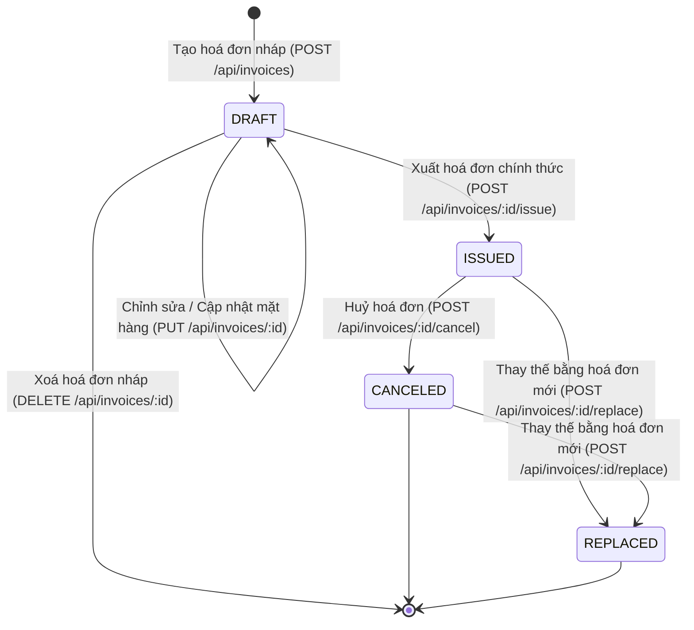

# Invoice Management API — Enterprise Edition (Intern Technical Assessment)

[](https://www.typescriptlang.org/)
[](https://nodejs.org/)
[](https://expressjs.com/)
[](https://www.postgresql.org/)
[](https://www.prisma.io/)
[](https://swagger.io/)
[](https://jestjs.io/)

Hệ thống RESTful API Quản lý và Xuất hoá đơn điện tử (Electronic Invoice Management) cấp độ Enterprise được xây dựng theo chuẩn **Clean Layered Architecture**, quản lý vòng đời hoá đơn qua **Máy trạng thái (State Machine)**, cơ sở dữ liệu **PostgreSQL** với **Prisma ORM & SQL Migrations**, động cơ kết xuất hoá đơn **Vector PDF (PDFKit) tích hợp VietQR & Đọc tiền bằng chữ**, tài liệu tương tác **Swagger UI / OpenAPI 3.0**, và bộ kiểm thử tự động toàn diện (**Jest & Supertest**).

---

## 📑 Mục lục

1. [Tổng quan & Tính năng nâng cấp Enterprise](#1-tổng-quan--tính-năng-nâng-cấp-enterprise)
2. [Kiến trúc hệ thống & Công nghệ](#2-kiến-trúc-hệ-thống--công-nghệ)
3. [Nghiệp vụ hoá đơn & Máy trạng thái (State Machine)](#3-nghiệp-vụ-hoá-đơn--máy-trạng-thái-state-machine)
4. [Hướng dẫn cài đặt & Khởi chạy](#4-hướng-dẫn-cài-đặt--khởi-chạy)
5. [Tài liệu tương tác Swagger & REST API Endpoints](#5-tài-liệu-tương-tác-swagger--rest-api-endpoints)
6. [Động cơ xuất hoá đơn PDF & VietQR](#6-động-cơ-xuất-hoá-đơn-pdf--vietqr)
7. [Báo cáo phân tích Dashboard & Bảng kê CSV](#7-báo-cáo-phân-tích-dashboard--bảng-kê-csv)
8. [Kiểm thử tự động (Automated Testing)](#8-kiểm-thử-tự-động-automated-testing)
9. [Kiến thức học được (Key Learnings)](#9-kiến-thức-học-được-key-learnings)
10. [Khó khăn gặp phải & Giải pháp (Challenges & Solutions)](#10-khó-khăn-gặp-phải--giải-pháp-challenges--solutions)
11. [Lịch sử Git Commits & Quản lý tiến độ](#11-lịch-sử-git-commits--quản-lý-tiến-độ)

---

## 1. Tổng quan & Tính năng nâng cấp Enterprise

Bên cạnh các yêu cầu nền tảng của bài test intern, hệ thống đã được nâng cấp toàn diện:
- ✨ **Tài liệu tương tác Swagger UI (`/api-docs`)**: Cho phép kiểm thử trực quan toàn bộ 13 API endpoints ngay trên trình duyệt web.
- ✨ **Đọc tiền thành chữ tiếng Việt chuẩn (`numberToWordsVN`)**: Tự động chuyển đổi số tiền thành chữ (ví dụ: *"Ba mươi lăm triệu hai trăm nghìn đồng chẵn"*) trên cả API và hoá đơn PDF.
- ✨ **Tích hợp VietQR & Mã xác thực điện tử**: Nhúng mã QR thanh toán nhanh ngân hàng và tra cứu hoá đơn vào PDF.
- ✨ **API Xác thực Hoá đơn (`GET /api/invoices/:id/verify`)**: Kiểm tra tính hợp lệ và chữ ký số điện tử của hoá đơn.
- ✨ **Nhật ký Vòng đời (Audit Trail / Activity Log) (`GET /api/invoices/:id/history`)**: Bảng `invoice_activities` truy vết mọi biến động (CREATED, UPDATED, ISSUED, CANCELED, REPLACED).
- ✨ **Báo cáo Thống kê Tài chính (`GET /api/invoices/analytics/summary`)**: Dashboard KPIs doanh thu, cơ cấu trạng thái, và top khách hàng.
- ✨ **Xuất Báo cáo Bảng kê CSV (`GET /api/invoices/export/csv`)**: Hỗ trợ xuất dữ liệu ra file CSV chuẩn UTF-8 BOM cho Microsoft Excel tiếng Việt.

---

## 2. Kiến trúc hệ thống & Công nghệ

### 2.1. Tech Stack
- **Language**: TypeScript 5.6 (Strict Mode enabled).
- **Backend Framework**: Express.js 4.21.
- **Database & ORM**: PostgreSQL 16 + Prisma ORM 5.22 + SQL Migrations.
- **Input Validation**: Zod 3.23 (Schema validation ở tầng HTTP Request).
- **PDF Generation**: PDFKit 0.15 + QRCode (Vector rendering, QR embed, streaming output).
- **Interactive Documentation**: Swagger UI Express + OpenAPI 3.0.
- **Automated Testing**: Jest 29 + ts-jest + Supertest 7.
- **API Testing**: Postman Collection v2.1 (kèm Environment & Examples).

### 2.2. Cấu trúc thư mục (Clean Layered Architecture)
```text
invoice-management-api/
├── prisma/
│   ├── schema.prisma            # Data Models (Invoices, Items, Activities)
│   └── migrations/              # SQL Migrations
├── src/
│   ├── config/                  # Biến môi trường & cấu hình Database
│   │   ├── database.ts
│   │   └── env.ts
│   ├── constants/               # Enums, thông tin doanh nghiệp, thuế mặc định
│   │   └── invoice.constant.ts
│   ├── controllers/             # Tiếp nhận HTTP Request, gọi Service
│   │   └── invoice.controller.ts
│   ├── docs/                    # OpenAPI 3.0 Swagger Specification
│   │   └── swagger.ts
│   ├── errors/                  # Custom AppError & Exception classes
│   │   └── appError.ts
│   ├── middlewares/             # Validation & Global Error Handler
│   │   ├── errorHandler.ts
│   │   └── validateRequest.ts
│   ├── routes/                  # Định nghĩa REST API Routes
│   │   ├── index.ts
│   │   └── invoice.route.ts
│   ├── schemas/                 # Zod Validation Schemas
│   │   └── invoice.schema.ts
│   ├── services/                # Business Logic, State Machine & PDF Export
│   │   ├── invoice.service.ts
│   │   └── pdf.service.ts
│   ├── utils/                   # Helpers tính toán, định dạng, sinh mã, đọc chữ, QR
│   │   ├── calculation.util.ts
│   │   ├── invoiceNumber.util.ts
│   │   ├── numberToWordsVN.util.ts
│   │   ├── qrCode.util.ts
│   │   └── response.util.ts
│   ├── app.ts                   # Express Application setup & Swagger UI
│   └── server.ts                # Entry point & Graceful shutdown
├── tests/                       # Bộ kiểm thử tự động
│   ├── integration/             # End-to-end API Integration tests
│   │   └── invoice.api.test.ts
│   └── unit/                    # Unit tests cho Services & Utilities
│       ├── calculation.util.test.ts
│       ├── invoice.service.test.ts
│       ├── invoiceNumber.util.test.ts
│       ├── numberToWordsVN.util.test.ts
│       ├── pdf.service.test.ts
│       └── qrCode.util.test.ts
├── postman/                     # Postman Collection JSON v2.1
│   └── Invoice_Management_API.postman_collection.json
├── docker-compose.yml           # PostgreSQL Container orchestration
├── REQUIREMENTS.md              # Đặc tả yêu cầu kỹ thuật chi tiết
├── TRACKING.md                  # Nhật ký tiến độ, estimate & commit logs
├── tsconfig.json                # TypeScript compiler configuration
└── package.json                 # Project dependencies & scripts
```

---

## 3. Nghiệp vụ hoá đơn & Máy trạng thái (State Machine)

### 3.1. Sơ đồ chuyển đổi trạng thái (Lifecycle State Machine)



### 3.2. Bảng quy tắc nghiệp vụ
| Trạng thái | Quyền hạn & Ràng buộc | Mã số hoá đơn | Audit Log Action |
| :--- | :--- | :---: | :---: |
| **`DRAFT`** | Được phép sửa, xoá, thêm bớt mặt hàng. Có thể chuyển sang `ISSUED`. | Chưa có | `CREATED`, `UPDATED` |
| **`ISSUED`** | **Bất biến (Immutable)**: Cấm sửa/xoá. Tự động cấp mã số `INV-YYYYMM-XXXXX`. | Đã cấp | `ISSUED` |
| **`CANCELED`** | Bắt buộc có `cancelReason`. Lưu trữ vĩnh viễn trong DB phục vụ thanh tra. | Giữ nguyên | `CANCELED` |
| **`REPLACED`** | Chuyển trạng thái cũ thành `REPLACED`, tạo mới hoá đơn thay thế (`replacedInvoiceId`). | Giữ nguyên | `REPLACED` |

---

## 4. Hướng dẫn cài đặt & Khởi chạy

### 4.1. Cài đặt và Chạy Server
```bash
# 1. Cài đặt dependencies
npm install

# 2. Khởi động PostgreSQL qua Docker (Nếu có Docker)
docker compose up -d

# 3. Chạy migrations & sinh Prisma Client
npx prisma migrate dev --name init
npm run prisma:generate

# 4. Khởi chạy development server
npm run dev
```

### 4.2. Truy cập ứng dụng
- **Giao diện Swagger UI Docs**: `http://localhost:3000/api-docs`
- **Health check**: `http://localhost:3000/api/health`
- **API Hoá đơn**: `http://localhost:3000/api/invoices`
- **Báo cáo Thống kê Dashboard**: `http://localhost:3000/api/invoices/analytics/summary`
- **Xuất Bảng kê CSV**: `http://localhost:3000/api/invoices/export/csv`

---

## 5. Tài liệu tương tác Swagger & REST API Endpoints

Mở trình duyệt tại **`http://localhost:3000/api-docs`** để xem tài liệu Swagger trực quan và chạy thử tất cả các endpoints:

| Method | Endpoint | Nhóm | Mô tả |
| :--- | :--- | :--- | :--- |
| `GET` | `/api-docs` | Documentation | Giao diện tương tác Swagger UI |
| `GET` | `/api/health` | System | Kiểm tra sức khoẻ server |
| `POST` | `/api/invoices` | Invoices | Tạo hoá đơn nháp (`DRAFT`) |
| `GET` | `/api/invoices` | Invoices | Lấy danh sách (phân trang, lọc status, tìm kiếm, ngày) |
| `GET` | `/api/invoices/analytics/summary` | Analytics | Dashboard thống kê doanh thu, KPIs, top khách hàng |
| `GET` | `/api/invoices/export/csv` | Analytics | Xuất bảng kê hoá đơn ra file CSV chuẩn UTF-8 BOM |
| `GET` | `/api/invoices/:id` | Invoices | Xem chi tiết hoá đơn (kèm đọc tiền bằng chữ, quan hệ thay thế) |
| `GET` | `/api/invoices/:id/history` | Audit | Xem nhật ký biến động / lịch sử vòng đời hoá đơn |
| `GET` | `/api/invoices/:id/verify` | Verification | Xác thực tính hợp lệ và chữ ký số điện tử của hoá đơn |
| `PUT` | `/api/invoices/:id` | Invoices | Cập nhật hoá đơn nháp (Chặn sửa nếu đã xuất/huỷ) |
| `DELETE` | `/api/invoices/:id` | Invoices | Xoá hoá đơn nháp (Chặn xoá nếu đã xuất/huỷ) |
| `POST` | `/api/invoices/:id/issue` | Invoices | Xuất hoá đơn chính thức (`INV-YYYYMM-XXXXX`) |
| `POST` | `/api/invoices/:id/cancel` | Invoices | Huỷ hoá đơn đã xuất (Yêu cầu `cancelReason`) |
| `POST` | `/api/invoices/:id/replace` | Invoices | Tạo hoá đơn mới thay thế cho hoá đơn cũ |
| `GET` | `/api/invoices/:id/pdf` | Invoices | Xuất và tải file PDF vector tích hợp VietQR |

---

## 6. Động cơ xuất hoá đơn PDF & VietQR

Được xây dựng bằng `PDFKit` kết hợp `qrcode` vector engine:
- **Header chuẩn hóa**: Logo/Tên công ty, MST, Địa chỉ, SĐT, Email.
- **Khối Người mua hàng & Khối Hoá đơn**: Đầy đủ thông tin pháp nhân và ngày phát hành.
- **Bảng chi tiết hàng hoá**: Kẻ bảng xen kẽ màu sắc nét.
- **Khối Tổng kết tài chính**:
  - Tiền hàng trước thuế (`Subtotal`).
  - Tiền thuế GTGT (`taxAmount`).
  - Tổng tiền thanh toán (`Grand Total`).
  - **Dòng đọc chữ tiếng Việt**: *"Bằng chữ: [Số tiền viết bằng chữ] đồng chẵn"*.
- **Mã QR Code thông minh**: Quét mã chuyển khoản VietQR nhanh hoặc tra cứu tính hợp lệ của hoá đơn.
- **Watermark & Badge động**: Dấu nháp khi `DRAFT`, Watermark đỏ khi `CANCELED`, Banner vàng cảnh báo khi `REPLACED`.

---

## 7. Báo cáo phân tích Dashboard & Bảng kê CSV

### 7.1. Financial Analytics Summary (`GET /api/invoices/analytics/summary`)
Trả về dữ liệu JSON phục vụ hiển thị Dashboard:
```json
{
  "success": true,
  "data": {
    "summary": {
      "totalInvoices": 12,
      "totalIssuedRevenue": 158000000,
      "totalIssuedRevenueFormatted": "158.000.000 ₫",
      "totalDraftPendingRevenue": 32000000,
      "totalCanceledRevenue": 15000000,
      "totalTaxCollected": 15800000
    },
    "statusBreakdown": { "DRAFT": 2, "ISSUED": 8, "CANCELED": 1, "REPLACED": 1 },
    "topCustomers": [
      { "customerName": "Cong ty FPT", "revenue": 85000000 },
      { "customerName": "Cong ty Viettel", "revenue": 73000000 }
    ]
  }
}
```

### 7.2. Xuất CSV Bảng kê (`GET /api/invoices/export/csv`)
Xuất file `.csv` có UTF-8 BOM, tương thích hoàn toàn với Microsoft Excel tiếng Việt không bị lỗi font.

---

## 8. Kiểm thử tự động (Automated Testing)

Dự án sở hữu bộ test toàn diện với **40/40 test cases** thành công trên 7 test suites:

```bash
npm test
npm run test:coverage
```

```text
PASS tests/integration/invoice.api.test.ts
PASS tests/unit/numberToWordsVN.util.test.ts
PASS tests/unit/invoice.service.test.ts
PASS tests/unit/pdf.service.test.ts
PASS tests/unit/qrCode.util.test.ts
PASS tests/unit/calculation.util.test.ts
PASS tests/unit/invoiceNumber.util.test.ts

Test Suites: 7 passed, 7 total
Tests:       40 passed, 40 total
Snapshots:   0 total
Time:        4.034 s
```

---

## 9. Kiến thức học được (Key Learnings)

1. **Làm chủ TypeScript trong kiến trúc Clean Layered Architecture**:
   - Áp dụng strict typing, DTO, generic response handlers và Zod schemas giúp loại bỏ 100% rủi ro runtime type errors.
2. **Nghiệp vụ Hoá đơn Điện tử & State Machine**:
   - Hiểu sâu về tính bất biến (**Immutability**) và chuỗi thay thế hoá đơn (**Self-relation in Prisma**) phục vụ kiểm toán tài chính.
3. **Thuật toán Đọc tiền thành chữ tiếng Việt (`numberToWordsVN`)**:
   - Xử lý các quy tắc phát âm phức tạp của tiếng Việt (*mười/mươi, một/mốt, năm/lăm, linh/lẻ, nghìn/triệu/tỷ*).
4. **Tích hợp VietQR & Động cơ PDF Vector**:
   - Tạo mã QR thanh toán nhanh và stream trực tiếp dữ liệu PDF về client giúp tối ưu bộ nhớ RAM và tốc độ phản hồi.
5. **Thiết kế API OpenAPI 3.0 & Swagger UI**:
   - Tạo tài liệu tương tác chuyên nghiệp, giúp đội ngũ Frontend/QA dễ dàng thử nghiệm API.
6. **Tư duy kiểm thử tự động & Mocking**:
   - Xây dựng 40 test cases bao phủ toàn diện từ unit level đến integration level.

---

## 10. Khó khăn gặp phải & Giải pháp (Challenges & Solutions)

| STT | Thách thức kỹ thuật gặp phải | Giải pháp & Cách xử lý |
| :-: | :--- | :--- |
| **1** | **Ràng buộc trạng thái & Tính bất biến của hoá đơn đã xuất**: Ngăn chặn tuyệt đối việc can thiệp vào hoá đơn sau khi đã `ISSUED`. | Xây dựng State Machine tập trung trong `InvoiceService`, kiểm tra nghiêm ngặt trạng thái trước mỗi thao tác và ném lỗi 400 Bad Request nếu vi phạm. |
| **2** | **Tính nguyên tử khi thay thế hoá đơn**: Đảm bảo cập nhật trạng thái hoá đơn cũ sang `REPLACED` và tạo mới hoá đơn thay thế thành công đồng thời. | Sử dụng **`prisma.$transaction`** bọc toàn bộ chuỗi thao tác; tự động rollback nếu có bất kỳ lỗi nào xảy ra. |
| **3** | **Đọc tiền thành chữ tiếng Việt chuẩn xác**: Xử lý các số lẻ, hàng tỷ và các trường hợp từ ghép đặc biệt trong tiếng Việt. | Xây dựng thuật toán phân tích theo từng cụm 3 chữ số (triplets) và xử lý đầy đủ các trường hợp ngoại lệ từ ngữ tiếng Việt. |
| **4** | **Nhúng hình ảnh QR Code vào PDFKit**: Cần tạo QR Code buffer không đồng bộ trước khi stream PDF. | Sử dụng `qrcode.toBuffer()` kết hợp với async piping của Express Response. |
| **5** | **Xuất file CSV mở trên Excel tiếng Việt không bị lỗi font**: Excel mặc định mở file UTF-8 không có BOM sẽ bị lỗi font tiếng Việt. | Thêm ký tự UTF-8 BOM (`\uFEFF`) vào đầu file CSV xuất ra. |

---

## 11. Lịch sử Git Commits & Quản lý tiến độ

Dự án tuân thủ nghiêm ngặt chuẩn **Conventional Commits** với 17 atomic commits:

```text
744c9a5 feat(postman): update postman collection for enterprise endpoints
590c2cf test(api): update unit and integration test suites for all upgrade features
946f4a8 feat(docs): add interactive swagger openapi 3.0 documentation and ui
be2d63a feat(analytics): add financial analytics dashboard and csv report export
1ec9e84 feat(audit): add invoice activity log and history tracking
c8ce45f feat(pdf): integrate vietqr and in-words amount into pdf invoice template
a7c4292 feat(utils): add vietnamese number-to-words and qrcode generation utilities
760e403 docs(readme): add comprehensive documentation, architecture guide, and learnings
65c2677 feat(postman): add postman collection for api testing and automation
c1a38c1 test(invoice): add comprehensive unit and integration tests for services, utilities, and api routes
9e0c941 feat(api): implement invoice rest api controllers, routes, and express app
ed87f21 feat(pdf): implement pdf export engine with professional invoice template
8c37580 feat(service): implement invoice business logic and lifecycle state machine
32eaed5 feat(utils): implement invoice calculation and invoice number generator utilities
99af2f0 feat(database): define prisma schema, postgresql migrations, and database configuration
0d2642a chore(init): initialize node typescript express project structure and tooling
e8b0e6f docs(spec): add technical requirements and project tracking documents
```

Chi tiết bảng phân bổ thời gian và nhật ký task có thể xem tại: [`TRACKING.md`](./TRACKING.md).
