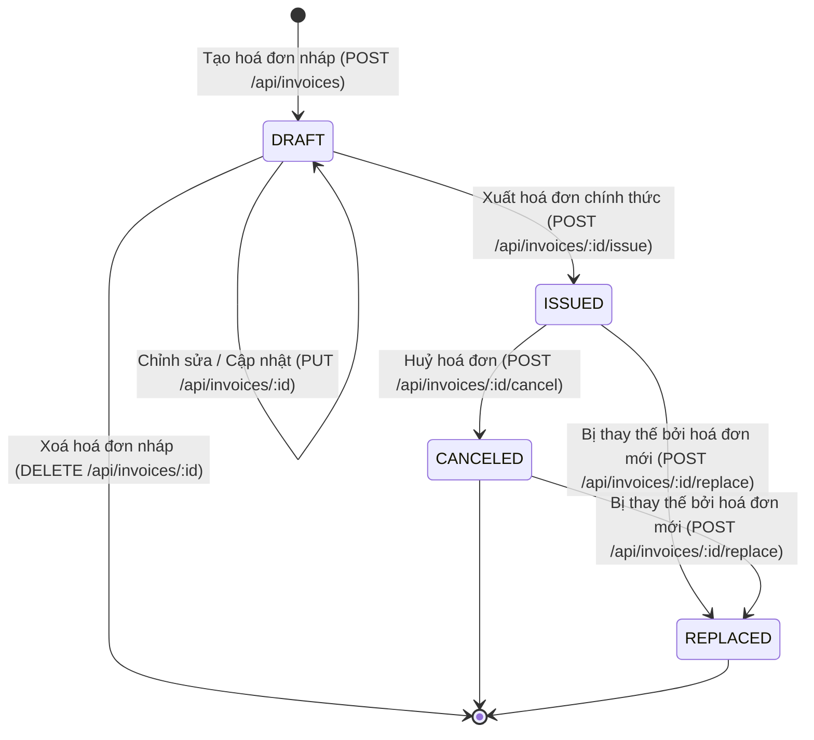

# Invoice Management API — Technical Assessment Specification

> **Dự án**: Invoice Management RESTful API  
> **Vị trí**: Backend Developer / Intern Technical Assessment  
> **Tech Stack**: TypeScript, Node.js, Express.js, PostgreSQL, Prisma ORM, PDFKit, Jest, Supertest, Postman

---

## 1. Tổng quan & Mục tiêu đánh giá (Assessment Objectives)

Tài liệu này chuẩn hoá toàn bộ yêu cầu kỹ thuật và quy chuẩn thực hiện cho bài kiểm tra năng lực kỹ thuật: **Xây dựng Invoice Management API**.

### 1.1. Các tiêu chí đánh giá trọng tâm
1. **Tinh thần học hỏi & Khả năng làm chủ công nghệ**:
   - Sử dụng thành thạo TypeScript (strict mode, typing rõ ràng, clean architecture).
   - Thiết kế cơ sở dữ liệu quan hệ với PostgreSQL và sử dụng Prisma ORM + SQL Migrations.
   - Xây dựng engine kết xuất hoá đơn PDF (PDFKit) với layout chuyên nghiệp.
2. **Kỹ năng phân tích & Giải quyết logic nghiệp vụ hoá đơn**:
   - Hiểu sâu vòng đời hoá đơn điện tử (State Machine): `DRAFT` ➔ `ISSUED` ➔ `CANCELED` / `REPLACED`.
   - Tính bất biến (Immutability) của hoá đơn sau khi đã xuất (`ISSUED`).
   - Xử lý nghiệp vụ thay thế hoá đơn (Invoice Replacement) và truy vết chuỗi thay thế (Audit Trail).
   - Tính toán chính xác số học tài chính: Đơn giá, Số lượng, Thành tiền, Thuế suất VAT, Tiền thuế, Tổng thanh toán.
3. **Kỹ năng lập trình & Clean Architecture**:
   - Cấu trúc thư mục phân tầng rõ ràng: Controller ➔ Service ➔ Repository / Prisma Client ➔ Validator / DTO ➔ Utils.
   - Validation dữ liệu chặt chẽ ở tầng đầu vào (Zod Schema Validation).
   - Quản lý lỗi tập trung (Global Centralized Error Handling) với chuẩn mã HTTP RESTful.
4. **Kỹ năng kiểm thử (Testing)**:
   - Viết Unit Tests và Integration Tests toàn diện cho các tầng Service và API Endpoints.
   - Đảm bảo kiểm thử đầy đủ các luồng thành công (Happy Path) và các trường hợp biên/lỗi (Edge Cases, Validation Errors, State Violation Errors).
5. **Kỹ năng ước lượng (Estimation) & Quản lý tiến độ**:
   - Estimate chi tiết thời gian thực hiện từng task trước khi code.
   - Theo dõi tiến độ thực tế so với kế hoạch trong file `TRACKING.md`.
6. **Quy chuẩn làm việc & Tinh thần cầu tiến (Documentation & Git Best Practices)**:
   - Viết `README.md` chỉn chu: Kiến trúc, cách cài đặt, cách chạy, API Documentation, những kiến thức học được và các thách thức kỹ thuật đã vượt qua.
   - Tuân thủ nghiêm ngặt **Conventional Commits**: Commit nguyên tử (Atomic commits), không gộp nhiều tính năng vào một commit.

---

## 2. Kiến trúc & Công nghệ (Architecture & Tech Stack)

| Thành phần | Công nghệ / Thư viện | Mục đích |
| :--- | :--- | :--- |
| **Language** | TypeScript (v5.x) | Static typing, an toàn kiểu dữ liệu, OOP & Functional patterns |
| **Runtime & Framework** | Node.js (v20+) & Express.js (v4.x) | Xây dựng RESTful API server hiệu năng cao |
| **Database** | PostgreSQL | Hệ quản trị cơ sở dữ liệu quan hệ chính |
| **ORM & Migrations** | Prisma ORM | Quản lý schema, tạo migrations SQL, type-safe database queries |
| **Validation** | Zod | Request body/params/query validation |
| **PDF Generation** | PDFKit | Tạo file PDF hoá đơn vector sắc nét, layout chuẩn |
| **Unit & Integration Test** | Jest, ts-jest, Supertest | Kiểm thử tự động tầng Service và API Routes |
| **API Testing Tool** | Postman Collection (v2.1) | Bộ test cases API có sẵn môi trường và mẫu dữ liệu |
| **Code Style & Git** | ESLint, Prettier, Conventional Commits | Chuẩn hoá code format và lịch sử git commit |

### 2.1. Cấu trúc thư mục dự án (Layered Architecture)
```text
invoice-management-api/
├── prisma/
│   ├── schema.prisma            # Định nghĩa DB Schema
│   └── migrations/              # SQL Migrations tự động tạo từ Prisma
├── src/
│   ├── config/                  # Configuration & Environment variables
│   │   └── env.ts
│   ├── constants/               # Enums, Error Codes, Statuses
│   │   └── invoice.constant.ts
│   ├── controllers/             # HTTP Request Handlers
│   │   └── invoice.controller.ts
│   ├── middlewares/             # Error Handler, Validation, Logger middlewares
│   │   ├── errorHandler.ts
│   │   └── validateRequest.ts
│   ├── routes/                  # API Route Definitions
│   │   ├── index.ts
│   │   └── invoice.route.ts
│   ├── schemas/                 # Zod Validation Schemas & DTOs
│   │   └── invoice.schema.ts
│   ├── services/                # Core Business Logic & State Machine
│   │   ├── invoice.service.ts
│   │   └── pdf.service.ts       # PDF Template & Generation Engine
│   ├── utils/                   # Helper functions, Currency formatters, Math
│   │   ├── calculation.util.ts
│   │   ├── invoiceNumber.util.ts
│   │   └── response.util.ts
│   ├── app.ts                   # Express App configuration
│   └── server.ts                # Application Entry point
├── tests/                       # Automated Test Suite
│   ├── unit/                    # Unit tests for Services & Utilities
│   │   ├── invoice.service.test.ts
│   │   └── calculation.util.test.ts
│   └── integration/             # Integration tests for API Endpoints
│       └── invoice.api.test.ts
├── postman/                     # Postman Collection & Environment
│   └── Invoice_Management_API.postman_collection.json
├── REQUIREMENTS.md              # Tài liệu đặc tả kỹ thuật chi tiết
├── TRACKING.md                  # File theo dõi tiến độ & estimate
├── README.md                    # Tài liệu hướng dẫn & Báo cáo đánh giá
├── tsconfig.json                # TypeScript Configuration
└── package.json                 # Project dependencies & scripts
```

---

## 3. Nghiệp vụ hoá đơn & Máy trạng thái (Domain & State Machine)

### 3.1. Các trạng thái của hoá đơn (`InvoiceStatus`)



| Trạng thái | Mô tả nghiệp vụ | Quyền hạn / Ràng buộc |
| :--- | :--- | :--- |
| **`DRAFT`** | Hoá đơn nháp đang soạn thảo. Chưa có giá trị pháp lý/thanh toán chính thức. | - Có thể cập nhật thông tin khách hàng, thêm/sửa/xoá dòng hàng.<br>- Có thể xoá hoàn toàn khỏi hệ thống.<br>- Có thể xuất thành `ISSUED`. |
| **`ISSUED`** | Hoá đơn đã xuất chính thức. Có giá trị pháp lý. | - **Bất biến (Immutable)**: KHÔNG ĐƯỢC PHÉP sửa đổi hoặc xoá.<br>- Tự động cấp mã số hoá đơn duy nhất theo quy chuẩn (ví dụ: `INV-202608-00001`).<br>- Ghi nhận ngày giờ xuất (`issuedAt`).<br>- Được phép xuất file PDF chuẩn có mã số hoá đơn.<br>- Chỉ có thể chuyển sang `CANCELED` hoặc `REPLACED`. |
| **`CANCELED`** | Hoá đơn đã bị huỷ bỏ (do sai sót thông tin, huỷ giao dịch, khách hàng trả hàng,...). | - Bắt buộc phải nhập lý do huỷ (`cancelReason`).<br>- Ghi nhận ngày giờ huỷ (`canceledAt`).<br>- Không được xoá khỏi database (lưu trữ phục vụ kiểm toán).<br>- File PDF xuất ra sẽ có watermark/badge rõ ràng: **"CANCELED / ĐÃ HUỶ"**.<br>- Có thể tạo hoá đơn mới để thay thế hoá đơn đã huỷ. |
| **`REPLACED`** | Hoá đơn đã bị thay thế bởi một hoá đơn mới. | - Ghi nhận liên kết đến hoá đơn thay thế mới (`replacedByInvoiceId`).<br>- Hoá đơn mới sẽ chứa mã tham chiếu `replacedInvoiceId` trỏ về hoá đơn cũ.<br>- File PDF hiển thị ghi chú: *"Hoá đơn này thay thế cho hoá đơn số [Mã số cũ] ngày [Ngày cũ]"*. |

### 3.2. Quy tắc tính toán tài chính (Financial Calculations)
1. **Dòng sản phẩm (`InvoiceItem`)**:
   $$\text{amount} = \text{quantity} \times \text{unitPrice}$$
2. **Tổng tiền trước thuế (`subtotal`)**:
   $$\text{subtotal} = \sum \text{amount}$$
3. **Tiền thuế GTGT / VAT (`taxAmount`)**:
   $$\text{taxAmount} = \text{round}\left(\text{subtotal} \times \frac{\text{taxRate}}{100}\right)$$
4. **Tổng tiền thanh toán (`totalAmount`)**:
   $$\text{totalAmount} = \text{subtotal} + \text{taxAmount}$$
5. **Ràng buộc**: Số lượng $\ge 1$, đơn giá $\ge 0$, thuế suất $\ge 0\%$ (ví dụ: 0%, 5%, 8%, 10%).

---

## 4. Thiết kế Database Schema (Prisma)

### 4.1. Thực thể `Invoice` & `InvoiceItem`

```prisma
datasource db {
  provider = "postgresql"
  url      = env("DATABASE_URL")
}

generator client {
  provider = "prisma-client-js"
}

enum InvoiceStatus {
  DRAFT
  ISSUED
  CANCELED
  REPLACED
}

model Invoice {
  id                  String         @id @default(uuid())
  invoiceNumber       String?        @unique @map("invoice_number")
  status              InvoiceStatus  @default(DRAFT)
  
  // Thông tin người mua / Khách hàng
  customerName        String         @map("customer_name")
  customerEmail       String?        @map("customer_email")
  customerAddress     String?        @map("customer_address")
  customerTaxCode     String?        @map("customer_tax_code")
  
  // Thông tin tài chính
  subtotal            Decimal        @db.Decimal(15, 2) @default(0)
  taxRate             Decimal        @db.Decimal(5, 2) @default(10)
  taxAmount           Decimal        @db.Decimal(15, 2) @default(0)
  totalAmount         Decimal        @db.Decimal(15, 2) @default(0)
  
  // Ghi chú & Lý do huỷ / thay thế
  notes               String?
  cancelReason        String?        @map("cancel_reason")
  
  // Timestamps nghiệp vụ
  issuedAt            DateTime?      @map("issued_at")
  canceledAt          DateTime?      @map("canceled_at")
  
  // Quan hệ tự tham chiếu cho nghiệp vụ thay thế hoá đơn (Self-relation)
  replacedInvoiceId   String?        @map("replaced_invoice_id")
  replacedInvoice     Invoice?       @relation("InvoiceReplacement", fields: [replacedInvoiceId], references: [id], onDelete: SetNull)
  replacementInvoices Invoice[]      @relation("InvoiceReplacement")
  
  // Chi tiết dòng hàng
  items               InvoiceItem[]
  
  createdAt           DateTime       @default(now()) @map("created_at")
  updatedAt           DateTime       @updatedAt @map("updated_at")

  @@map("invoices")
}

model InvoiceItem {
  id          String   @id @default(uuid())
  invoiceId   String   @map("invoice_id")
  invoice     Invoice  @relation(fields: [invoiceId], references: [id], onDelete: Cascade)
  
  description String
  quantity    Int      @default(1)
  unitPrice   Decimal  @db.Decimal(15, 2) @map("unit_price")
  amount      Decimal  @db.Decimal(15, 2)
  
  createdAt   DateTime @default(now()) @map("created_at")
  updatedAt   DateTime @updatedAt @map("updated_at")

  @@map("invoice_items")
}
```

---

## 5. Đặc tả REST API Endpoints

| STT | HTTP Method | Endpoint | Trạng thái áp dụng | Mô tả chức năng |
| :---: | :--- | :--- | :--- | :--- |
| 1 | `POST` | `/api/invoices` | Tạo mới (`DRAFT`) | Tạo hoá đơn nháp ban đầu cùng danh sách dòng hàng |
| 2 | `GET` | `/api/invoices` | Tất cả | Lấy danh sách hoá đơn (phân trang, lọc theo status, search từ khoá, khoảng ngày) |
| 3 | `GET` | `/api/invoices/:id` | Tất cả | Lấy chi tiết 1 hoá đơn (kèm danh sách hàng, thông tin thay thế) |
| 4 | `PUT` | `/api/invoices/:id` | `DRAFT` | Cập nhật thông tin hoá đơn nháp (Chặn sửa nếu đã `ISSUED`/`CANCELED`/`REPLACED`) |
| 5 | `DELETE` | `/api/invoices/:id` | `DRAFT` | Xoá hoá đơn nháp (Chặn xoá nếu đã `ISSUED`/`CANCELED`/`REPLACED`) |
| 6 | `POST` | `/api/invoices/:id/issue` | `DRAFT` ➔ `ISSUED` | Xuất hoá đơn chính thức: sinh mã `invoiceNumber`, gán `issuedAt`, khoá chỉnh sửa |
| 7 | `POST` | `/api/invoices/:id/cancel` | `ISSUED` ➔ `CANCELED` | Huỷ hoá đơn đã xuất: nhận `cancelReason`, gán `canceledAt` |
| 8 | `POST` | `/api/invoices/:id/replace` | `ISSUED`/`CANCELED` ➔ `REPLACED` | Tạo hoá đơn mới thay thế hoá đơn cũ: cập nhật trạng thái cũ sang `REPLACED`, liên kết `replacedInvoiceId` |
| 9 | `GET` | `/api/invoices/:id/pdf` | `DRAFT`, `ISSUED`, `CANCELED`, `REPLACED` | Kết xuất và tải file PDF hoá đơn với layout chuẩn chuyên nghiệp |

---

## 6. Yêu cầu thiết kế PDF Hoá đơn (PDF Export Engine)

File PDF được sinh bằng `PDFKit` và trả về dạng stream (`Content-Type: application/pdf`, `Content-Disposition: inline` hoặc `attachment`):
1. **Header**:
   - Tên tổ chức/Công ty xuất hoá đơn (Tên công ty, MST, Địa chỉ, SĐT, Email).
   - Tiêu đề hoá đơn: **HOÁ ĐƠN GIÁ TRỊ GIA TĂNG / INVOICE**.
   - Mã số hoá đơn (`Invoice No`), Ngày phát hành (`Issue Date`), Trạng thái (`Status Badge`).
2. **Thông tin khách hàng (Customer Information)**:
   - Tên khách hàng / Đơn vị mua hàng (`Customer Name`).
   - Mã số thuế khách hàng (`Tax Code` nếu có).
   - Địa chỉ (`Address`), Email liên hệ.
3. **Bảng chi tiết hàng hoá / dịch vụ (Line Items Table)**:
   - STT (`#`), Tên hàng hoá/dịch vụ (`Description`), Số lượng (`Quantity`), Đơn giá (`Unit Price`), Thành tiền (`Amount`).
   - Kẻ bảng sạch đẹp, căn lề số học sang phải, căn lề chữ sang trái.
4. **Bảng tổng kết tài chính (Financial Summary)**:
   - Cộng tiền hàng (`Subtotal`).
   - Thuế suất GTGT & Tiền thuế GTGT (`VAT Rate %` & `VAT Amount`).
   - Tổng cộng tiền thanh toán (`Grand Total`).
5. **Watermark / Con dấu trạng thái**:
   - Nếu là `DRAFT`: Dấu chìm hoặc chữ ghi rõ **"BẢN NHÁP / DRAFT - CHƯA CÓ GIÁ TRỊ PHÁP LÝ"**.
   - Nếu là `CANCELED`: Watermark đỏ mờ **"ĐÃ HUỶ / CANCELED"** kèm lý do huỷ.
   - Nếu là `REPLACED`: Ghi chú rõ **"Hoá đơn thay thế cho số: [Mã cũ]"**.

---

## 7. Quy chuẩn Git & Quy trình Commit (Git Commit Workflow)

Tuân thủ nghiêm ngặt chuẩn **Conventional Commits**:
- **Format**: `<type>(<scope>): <mô tả ngắn gọn>`
- **Các type chuẩn**:
  - `feat`: Thêm tính năng mới (Feature)
  - `fix`: Sửa lỗi (Bug fix)
  - `test`: Viết hoặc cập nhật Unit/Integration tests
  - `refactor`: Tái cấu trúc code (không đổi logic bên ngoài)
  - `docs`: Viết/cập nhật tài liệu (README, REQUIREMENTS, API docs)
  - `chore`: Cấu hình build, dependencies, tooling, script
  - `style`: Định dạng code, format, linter fixes

### Quy tắc bất di bất dịch:
1. **Atomic Commits**: Mỗi commit chỉ đại diện cho một thay đổi logic duy nhất.
2. **Không gộp nhiều tính năng vào 1 commit**.
3. **Commit message bằng tiếng Anh hoặc tiếng Việt chuẩn mực**, rõ nghĩa.

---

## 8. Danh mục bàn giao (Deliverables Checklist)

- [x] **Tài liệu đặc tả yêu cầu**: `REQUIREMENTS.md`
- [x] **File theo dõi tiến độ & Estimate**: `TRACKING.md`
- [ ] **Mã nguồn TypeScript hoàn chỉnh**: Cấu trúc phân tầng chuẩn mực
- [ ] **Database Schema & SQL Migrations**: `schema.prisma` + `prisma/migrations/`
- [ ] **PDF Export Engine**: Vector PDF template với PDFKit
- [ ] **Bộ Unit & Integration Tests**: Độ phủ cao cho Service và Controller
- [ ] **Postman Collection**: File JSON sẵn sàng import và chạy test
- [ ] **Tài liệu README.md chi tiết**:
  - Hướng dẫn cài đặt, cấu hình `.env`, chạy migration, chạy dev server, chạy tests.
  - Phân tích kiến trúc và giải thích luồng nghiệp vụ hoá đơn.
  - **Mục "Kiến thức học được" (Key Learnings)**: Trình bày chi tiết những gì học được trong quá trình thực hiện bài test.
  - **Mục "Khó khăn & Giải pháp" (Challenges & Solutions)**: Trình bày các vấn đề kỹ thuật gặp phải và cách giải quyết.
